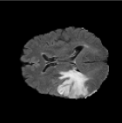
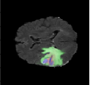

# 3D MRI Brain Tumor Segmentation using U-Net 🧠

This project implements a deep learning pipeline for segmenting brain tumors from 3D MRI scans using a U-Net architecture in PyTorch. The model is trained on the BraTS dataset and achieves high segmentation performance.

---

## 🧪 Try It on Colab

[](https://colab.research.google.com/drive/1UxVTV3YE0lugZd7k3Zm9bdYg74uJ_3kB?usp=drive_link)


---

## 🗂️ Dataset

We use the **BraTS (Brain Tumor Segmentation)** dataset:

- 🔗 [Kaggle BraTS 2020 Dataset](https://www.kaggle.com/datasets/awsaf49/brats20-dataset-training-validation)
- 🔗 [Official BraTS Dataset Site](https://www.med.upenn.edu/cbica/brats2020/data.html)

> 💡 After downloading, place the dataset inside a folder named `data/` in the project root.

---

## 📊 Results

| Metric                | Value     |
|------------------------|-----------|
| Dice Coefficient       | **0.994** |
| Test Accuracy          | **99.4%** |
| Loss (final epoch)     | ~0.02     |

---

## 🖼️ Example Output

Below is a sample output showing a slice from the 3D MRI scan and its corresponding predicted tumor mask:

| Original Slice | Tumor Mask Prediction |
|----------------|------------------------|
| 
| 


> Images are visualizations from model predictions using the BraTS validation set.

---

## 📦 Dependencies

- Python 3.8+
- PyTorch
- NumPy, Pandas
- nibabel
- matplotlib, seaborn
- scikit-learn

Install all dependencies using:

```bash
pip install -r requirements.txt
```

---

## 👨‍💻 Author

**Abdelrahman Abdelgawad**  
M.Eng. Data Science – TU Darmstadt  
📧 abdelrahmansaeed291@gmail.com  
